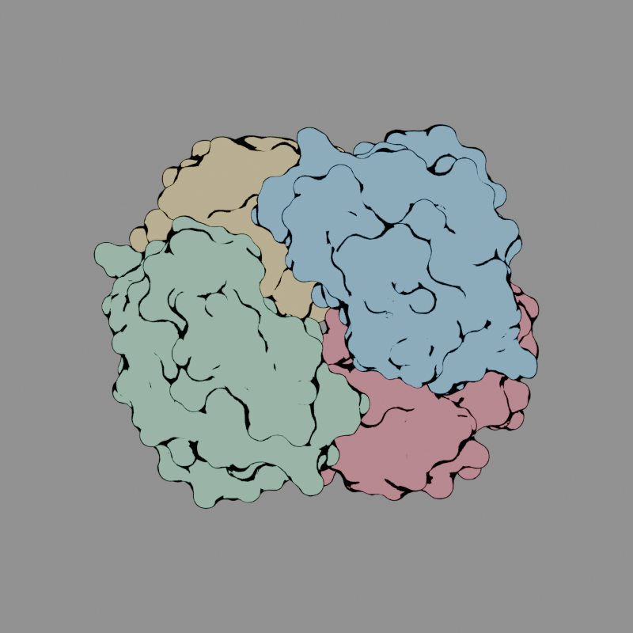
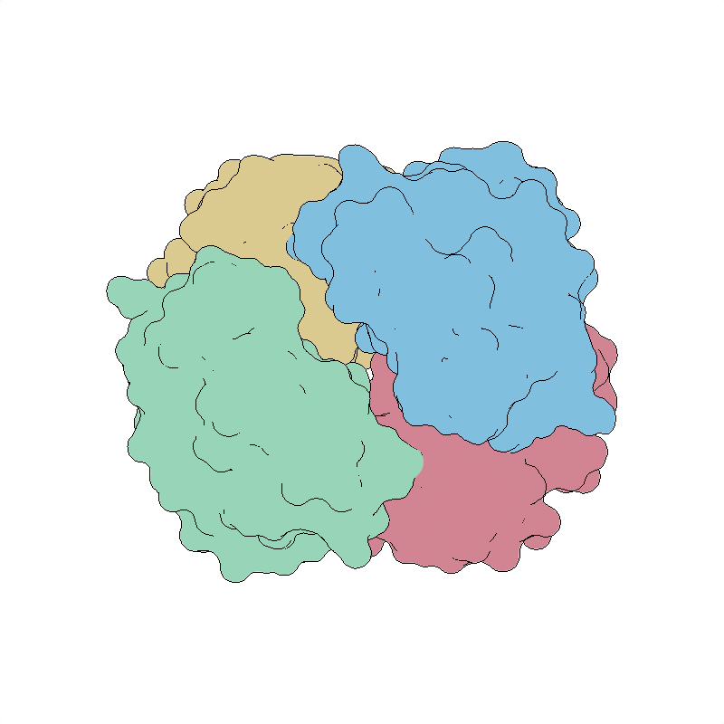

# Bright Illustration: ChimeraX-style silhouettes

Branch: `fix/chimerax-illustration`.

Bright Illustration now produces flat molecular colors with thin black depth
silhouettes and a white background. The previous surface-angle shader created
thick patches at grazing angles and missed boundaries between overlapping,
front-facing surfaces. The replacement follows ChimeraX's Flat silhouette method:
a circular pixel neighborhood, a 1% scene-depth threshold, and ink on the farther
side of a visible depth boundary.

| Before | After |
|---|---|
|  |  |

Both images show the same bundled **4HHB hemoglobin** surface, chain colors,
camera, and 800 × 800 output. They were rendered in Blender 5.2 with Cycles.
The previous material wrapper was executed for the before image; applying the
new preset upgraded that same scene for the after image. The source protein in
the user's screenshot was not identified, so this is a controlled comparison
on a different protein.

## Demonstration

1. Restart Blender to load the installed update. Open the protein scene.
2. Choose **Set Up Lighting → Bright Illustration → Apply**.
3. Observe flat colors, the white background, and the removal of floor, axis,
   cursor, relationship, and light/camera guides. Selection controls remain usable.
4. Toggle **Outlines**, then Apply. Enable it again and compare **Width (px)**
   values of 1 and 3. The default is 1; the range is 1–4.
5. Rotate the model. Boundaries follow visible depth, including overlaps between
   chains. Apply remains in the open dialog; OK applies and closes.
6. Apply **Soft Studio**. The original material shading, compositor, display
   transform, and guide visibility return. Closing after Apply keeps the result.
7. Save/reopen or render with Eevee/Cycles. The outline compositor is stored in
   the file, with the required depth passes enabled.

## Change details

- Replaced normal-angle contour coloring with compositor depth silhouettes.
  The scene-depth calculation uses the fitted bounding sphere and ChimeraX's
  1% padding. A bounded depth encoding makes the comparison work with linear
  depth in both perspective and orthographic views.
- Added the pixel-width control; hid light orientation for this flat preset.
- Bright Illustration uses Standard color management, neutral exposure/gamma,
  and a white world. Previous display settings are restored on another preset.
- Enabled the viewport compositor for Material Preview and suppressed scene
  guides while preserving selection/editing overlays.
- Kept original artist compositor graphs intact. The effect edits a copy,
  supports Render Layers and implicit Combined inputs, and restores the original
  graph and depth-pass settings when disabled. Repeated Apply does not accumulate
  compositor copies or material wrappers.
- Preserved molecular opacity, animated fades, original material connections,
  and the shader bypass used to return to shaded presets. Old illustration
  wrappers are upgraded when Apply is used.

## Reference and practical limits

The implementation follows the depth rule in the official
[ChimeraX silhouette shader](https://github.com/RBVI/ChimeraX/blob/develop/src/bundles/graphics/src/fragmentShader.txt)
and [view clipping calculation](https://github.com/RBVI/ChimeraX/blob/develop/src/bundles/graphics/src/view.py).
The [ChimeraX Graphics toolbar](https://www.cgl.ucsf.edu/chimerax/docs/user/tools/graphics.html)
describes the Flat appearance. This is the same rendering approach; different
surface meshes, antialiasing, and transparency handling can still produce
different pixels between applications.

Use **Material Preview** for viewport outlines. Final **Eevee and Cycles renders**
both support them; Cycles Rendered viewport lacks the required compositor depth
pass. Apply again after changing the overall model size, since the fitted depth
range is set at Apply. Custom shader graphs without a directly connected
Principled shader retain their own shading. A separate check of the atom
**spheres** representation showed a blocky Eevee viewport appearance with both
the original and updated shader; this preexisting representation issue is outside
the surface-contour fix demonstrated here.

## Verification

The new regression was reproduced before the product edit: overlapping
front-facing surfaces had no boundary, and the old contour thickened from 3 to
7 pixels as thumbnail resolution doubled. Final pixel tests cover both render
engines, both camera projections, widths 1/3, existing compositor inputs, and
transparent-film silhouettes. The curved-surface width check uses 512/1024-pixel
images: at thumbnail sizes, even the reference depth threshold detects steep
continuous curvature beside a silhouette.

Tests also cover saved compositor topology and display settings, molecular
opacity/fades, repeated Apply, restoration, and real popup/viewport behavior.
- Blender 5.0: all 29 initial lighting cases passed; the final expanded
  silhouette matrix passed **19/19**.
- Blender 5.1: **39 passed**, covering lighting, silhouettes, and the lighting /
  illustration save/reopen cases.
- Installed normal profiles, Blender 5.1 and 5.2: **102/102 UI scenarios each**,
  followed by the focused settled-surface popup checks (**8/8 each**).
- Deployment byte-verified all **149 Python files** in the legacy and extension
  copies for Blender 5.0, 5.1, and 5.2. Existing user windows were left open;
  validation used fresh disposable windows.
- Full offline Blender 5.2 suite: **777 passed, 7 skipped, 2 network tests
  deselected, 1 existing expected failure** in 669 seconds, exit 0. No native
  crash/access-violation diagnostics. The skips concern panels without their own
  `poll()`; the expected failure is an existing modal pose-creation test.
- `git diff --check` and syntax checks passed.
