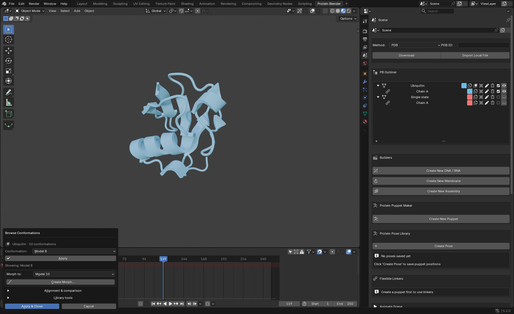

# Conformation library and browser

Branch: `feat/conformation-library`, based on `demo/weekly-improvements`.

One protein owns a library of named coordinate sets. Its **conformations icon**
opens a compact popup scoped to that protein. The icon appears only on protein
rows with multiple states; it has no text label. Switching states preserves the
playhead, transforms, styling, and domain layout. The library supplies two
endpoints to the existing independent morph workflow.

## Demo

1. Import **1D3Z** from PDB, or the bundled `tests/data/1d3z.pdb.gz`. Its Outliner
   row has a conformations icon. A single-state protein such as **1UBQ** has none.
2. Click the icon. Choose **Model 8** and click **Apply**. The popup remains open;
   **Showing** updates to Model 8 and the current scene frame remains unchanged.
3. Choose **Morph to → Model 1**, then **Create Morph…**. Set frames **10 → 30**,
   enable Return to start at **50**, and enable Repeat breathing cycle. Create
   the morph. Its independent Outliner entry has no children; its pencil opens
   playback.
4. For comparison, reopen the protein popup and expand **Alignment & comparison**.
   Choose Reference Model 1 and Stable core. Enable the transparent reference and
   orange motion markers, set the threshold to **0.5 Å**, then **Apply**. Use
   Cartoon representation to see the markers clearly.
5. **Library tools** reveals renaming, provenance, Add from File/PDB, Capture Pose,
   and Extract as Protein. Extraction places the copy at the same location; move
   it for side-by-side use.
6. **Apply & Close** commits pending view fields. Cancel/Escape keeps earlier
   Apply results and discards pending view fields. Either exit removes temporary
   comparison helpers. Optional sections start collapsed when reopened.
7. Save and reopen. Named coordinate sets, including inactive ones, are stored in
   the `.blend` without needing the input file.

## Popup simplification

The everyday interface now contains one state selector, Apply, and a morph
destination. Alignment, comparison, and library management remain available in
collapsed sections. The persistent panel beneath the Outliner, duplicate browsing
controls, and separate Set as Start/End buttons were removed from the interface.
The selected conformation and Morph to now define the animation endpoints.
Apply and Apply & Close follow the Lighting dialog's committed-change behavior.
Invalid alignment restores the previously applied view and settings together.
A failed confirmation also removes temporary comparison helpers when it closes.

## Implementation notes

- Coordinate meshes belong to the protein controller and are referenced through
  persistent Blender properties. Domain objects share the live atom mesh but
  do not inherit their own libraries. Protein duplication can share immutable
  coordinate sets safely; extraction creates a one-state library.
- MolecularNodes' implicit frame animation is bypassed when an ensemble enters
  the library. Browsing and explicit morph animation have separate timing.
- Every state aligns to the selected immutable reference. Revisiting a model
  does not accumulate alignment drift.
- Comparison helpers follow native chain/domain transforms, preserve source
  materials, and stay out of renders and the PB Outliner. Captured pose states
  compensate for existing domain transforms when displayed.
- Added-file batches require exact atom identities, including ligands. Atom
  order may differ. A mismatch reports missing/additional atoms before changing
  the library; separate imports retain the existing partial-match morph route.
- PDB/mmCIF experiment metadata identifies NMR ensembles. Legacy assembly
  filenames identify simultaneous copies. Ambiguous local model records need
  an explicit interpretation in the import dialog.
- The new badge exposed Outliner layout stretching. Right-aligned controls
  preserve equal total widths for solid and mixed-color swatches.
- A partial morph's surrounding context uses its chosen start state, even when
  a different model is currently displayed in the browser.

## Verification

Popup revision checks cover targeting the clicked protein while another protein
is active; applying exact coordinates; rejecting invalid alignment without
partial changes; icon visibility; compact and expanded layouts; Apply remaining
open; Cancel preserving applied changes and discarding pending fields; Apply &
Close; cleanup; and opening a morph dialog from the popup.

| Popup revision validation | Result |
|---|---|
| Blender 5.2: library, morph, and repository contracts | 44 passed; one network test excluded |
| Blender 5.1: conformation library | 13 passed; one network test excluded |
| Blender 5.2: focused foreground popup workflow | 31 scenarios passed |
| Blender 5.2: final library and repository contracts, including failed-confirmation cleanup | 23 passed; one network test excluded |
| Final deployed build: full foreground UI, Blender 5.1 normal profile | 109/109 scenarios passed |
| Final deployed build: full foreground UI, Blender 5.2 normal profile | 109/109 scenarios passed |

The following matrix records the original library implementation.

Regression coverage includes deposited PDB/mmCIF ensembles, a legacy assembly,
ambiguous imports, raw coordinate endpoints, rendered atom geometry, fixed
alignment references, invalid anchors, comparison cleanup, named endpoints,
breathing cycles, append rejection, pose capture, extraction, and deletion.
Foreground scenarios exercise the Outliner icon, popup, Apply/Cancel/confirmation,
collapsed tools, undo/redo, and nested morph dialog.
The save/reopen lane checks every stored coordinate mesh and switches states
again after reconstructing the scene in a fresh process.

| Validation | Result |
|---|---|
| Blender 5.2: affected integration suites, all save/reopen cases, persistence and repository contracts | 112 passed; one network test excluded |
| Blender 5.2: final library and existing morph tests, including PDB downloads and partial-region context | 34 passed |
| Blender 5.1: conformation integration and save/reopen cases | 37 passed |
| Blender 5.0: library compatibility and PDB download path | 11 passed |
| Final installed build: foreground UI, Blender 5.1 normal profile | 94/94 scenarios passed |
| Final installed build: foreground UI, Blender 5.2 normal profile | 94/94 scenarios passed |

The broader Blender 5.2 run emitted the same Windows access-violation diagnostics
inside pytest's environment-variable bookkeeping documented in the earlier
[verification notes](verification.md). It continued to completion with exit code
zero and all 112 tests passing. The final focused run completed
without those diagnostics. The 5.1 and 5.0 runs also completed without them.

The final code was deployed and byte-verified in all six local addon copies
(legacy and extension installations for Blender 5.0, 5.1, and 5.2). Validation
uses fresh normal-profile windows; an already-running user session needs a
restart to load the new code. No user session was closed.

## Scope

This release provides browsing and two-state morph creation. Ordered multi-state
sequence editing remains a follow-up. NMR model numbering supplies no motion
timing. Morph interpolation remains illustrative and can distort intermediate
atomic geometry. Comparison markers show backbone displacement; use Cartoon to
see them clearly. Exact file/PDB append and sequence-based partial morph matching
are deliberately different operations, with their compatibility rules visible
in the relevant error message.
