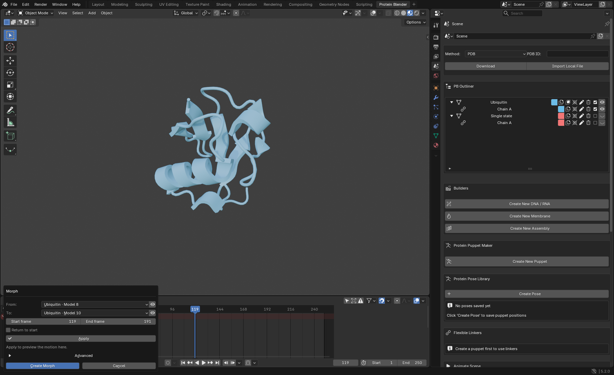
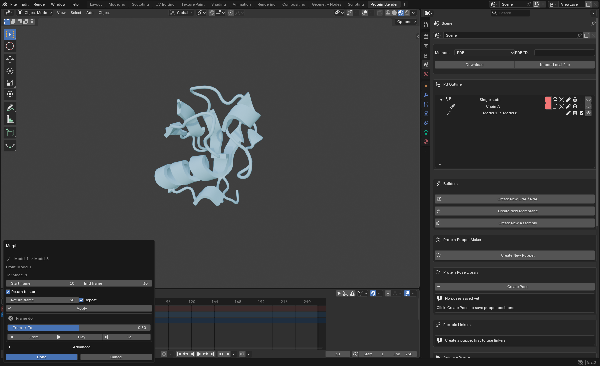

# One Morph interface

Branch: `feat/conformation-library`.

The protein conformation icon, Animate Scene → Morph, the protein visual editor,
and an existing morph's pencil now open the same contextual popup. The initial
view contains From, To, start/end frames, optional return motion, Apply, and one
collapsed Advanced section. Creating a morph no longer opens a separate playback
dialog.

## Demo

1. Import **1D3Z** and click its Outliner conformation icon. The From endpoint is
   the currently displayed model. Proteins with only one state still have no
   conformation icon; Morph remains available in Animate Scene and their visual
   editor.
2. Choose **Model 1** and **Model 8** as From and To. The eye beside either selector
   shows that state on the protein without moving the playhead or creating an
   animation.
3. Set frames **10 → 30**. Enable Return to start at **50**, and Repeat for a
   breathing cycle. Click **Apply**. Scrub From → To or press Play in this popup.
4. Change the timing and Apply again. Invalid settings keep the last valid
   preview. Cancel removes a new preview and restores the opening frame/range and
   original visibility. States explicitly shown with the eye buttons stay applied.
5. Reopen, Apply, and **Create Morph**. The preview becomes one independent
   Outliner object with no children. No second popup appears.
6. Open its pencil. The same popup contains stored From/To labels, timing,
   playback, Apply, and Advanced. Apply commits edits without closing; Done
   applies and closes. Cancel keeps earlier Apply results and discards pending
   fields. Deleting the source protein leaves this editing/playback workflow usable.
7. For two separate proteins, open Morph from Animate Scene and choose them from
   the same From/To menus. Named states from different proteins can be paired as
   well. Current structure uses the displayed coordinates; named states use their
   stored coordinates.

## Optional tools

Advanced holds chain/residue selection, alignment, easing, surrounding-region
opacity, representation, color, source visibility, and match details. Stored
morph endpoints remain fixed; create another morph to choose a different pair.

When comparing two states of one protein, transparent reference and motion
markers use From as their fixed reference, matching the morph's alignment.
Use the To eye button for comparison. Library tools inside Advanced retain naming, provenance,
file/PDB additions, pose capture, and extraction for the From protein.

## Implementation and regression notes

- A single registered Morph dialog supplies all public UI entry points. Existing
  scripted creation, editing, state-switching, and capture operators remain usable.
- Preview confirmation keeps the preview's object and shape keys. It creates no
  duplicate and schedules no additional dialog. Playback stops on either exit.
- Preview replacement is built before the prior preview is removed. Rejected
  settings preserve the last valid preview. Original visibility uses the existing
  ownership tracking so other morphs remain isolated. Shortening a preview also
  releases its prior timeline extension.
- Apply on an existing morph uses the undoable editing operator; its coordinates
  remain owned by the morph and do not require source proteins to exist.
- Stored endpoint matching now supports states from different protein objects,
  including a stored state paired with a currently displayed structure. Partial
  morph context uses the selected start coordinates.
- The foreground source-deletion scenario exposed a stale domain-mask node cache.
  The cache now stores names, and cleanup resolves each node immediately before
  deleting it. This avoids dereferencing freed Blender node wrappers.

## Verification

- Final installed normal-profile foreground suite: **102/102 passed on Blender
  5.1 and 102/102 on 5.2**, with no Python/draw exceptions. Each run launched a
  fresh window, imported the enabled installed package, and closed only its own
  test window. Reports: `/tmp/pb-unified-normal51/ui-report.json` and
  `/tmp/pb-unified-normal52/ui-report.json`.
- Blender 5.2 integration, domain/deletion, repository-contract, and persistence
  checks: **124 passed, 1 network test deselected**.
- Blender 5.1 conformation and fresh-process save/reopen checks: **42 passed**.
- Blender 5.0 conformation and domain/deletion checks: **55 passed, 1 network
  test deselected**. The final focused foreground Morph workflow also passed
  **24/24 scenarios** on Blender 5.0 and 5.2.
- The cross-protein state test failed on the previous restriction before the
  matching change. Foreground regressions separately failed before fixing the
  stale node cache, old preview range, reversed reference frame, and hidden chain
  pairing. The final foreground runs include all of these scenarios.
- The deployer byte-verified **148 Python files in each of six installed copies**
  across Blender 5.0, 5.1, and 5.2. Restart an already-open Blender to load them.
- Full Blender 5.2 offline suite: **758 passed, 7 skipped, 2 network tests
  deselected, 1 existing xfail**, exit 0, in 672.90 seconds. Log:
  `/tmp/pb-unified-full52.log`.
- **Test-run caveat:** the full suite emitted 81 Windows access-violation
  diagnostics while pytest updated its current-test environment variable and
  continued to completion. Earlier full-suite runs have recorded this class of
  diagnostic; its cause remains unresolved. The focused regression runs and
  foreground runs did not emit these diagnostics. The full suite also reported
  714 warnings, primarily Blender API deprecations.
